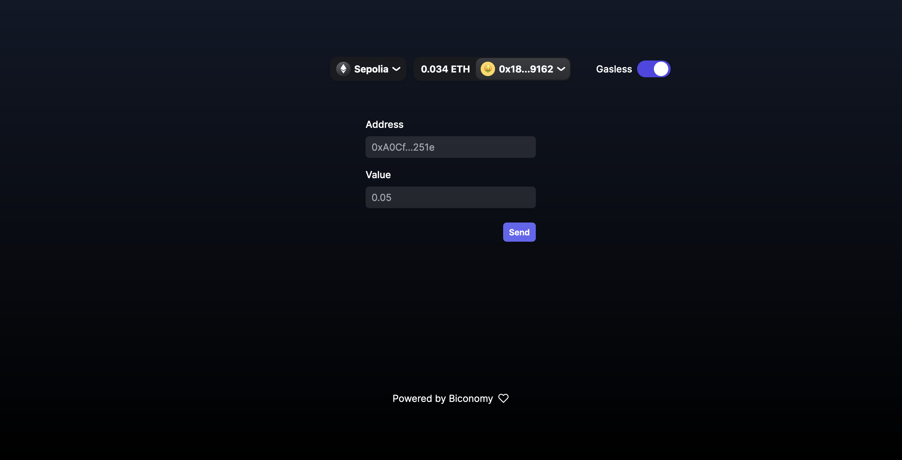

## Sending gasless transactions!

Showcasing Biconomy's Paymaster service by utilizing gasless transactions.
Check more on Paymaster service [here](https://docs.biconomy.io/paymaster)



## Getting Started

First, run the development server:

```bash
npm run dev
# or
yarn dev
# or
pnpm dev
# or
bun dev
```

Open [http://localhost:3000](http://localhost:3000) with your browser to see the result.

## Credits

Powered by Biconomy's SDK.
